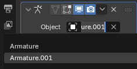
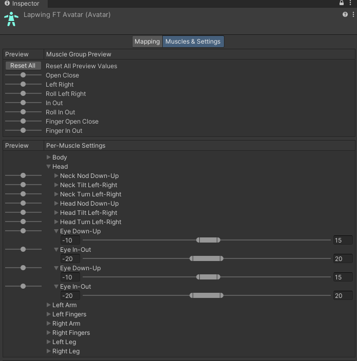
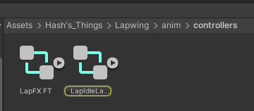

# Apply to a custom avatar

So you have a custom avatar and wish to use my face tracking on it, here's a guide on how to do so

## head swap
 You'll need to change the head from your custom model to the one that has the face tracking blendshapes and correct weights.
 here are some steps on how to do so

 ### Locate your custom model's main FBX file and back it up

 First you'll need to find your main FBX file that contains the head of your model.
 To do so:
 - Select it in your scene hierarchy by left clicking on it:
 
- go to the inspector tab (By default on the left hand side)

- Click on the avatar armature component (the little green icon of a person)

- This will reveal the file in the unity file explorer

- Right Click on the parent file of the avatar armature component
- Export Package
- Untick ``Include dependencies`` in the window that opens
- press ``Export...``
- Select where you want your backup to be stored at
- Return back to Unity
- Right Click on the file again
- Click ``Show In Explorer``

 ### Open Blender

- Download Blender [here](https://www.blender.org/download/)
- Follow the install wizzard
- Open Blender

 ### Clear the scene
 - Click anywhere on the viewport to remove the startup splash screen
 - press ``A`` to select everything
 - press ``Del`` to delete everything

 ### Import your custom model

 - Direct yourself at the top left of your window
 - Click ``File``
 - Click ``Import``
 - Click ``FBX``

 

 - Select where your custom model is located at

 

 - Press the ``Import FBX`` button at the bottom left of the window

 Your custom model should now be into Blender!
 Feel free to save it somewhere safe by pressing ``Ctrl``+``S`` to save your progress :)


### Import the face tracking model

Same steps as before

 - Direct yourself at the top left of your window
 - Click ``File``
 - Click ``Import``
 - Click ``FBX``

 - Select where the face tracking model is located at (Under Hash's_Things/AvatarName/fbx)

 - Press the ``Import FBX`` button at the bottom left of the window

 

### Matching materials

- Develop what's under the armature that should be named ``Armature.001`` and select the face tracking head mesh (named ``Body.001`` most times)

- Select the Materials tab 

- Click the black materials icon to change the curently selected material


- Select the version of the material without the ``.001`` at the end of its name


- Select the material bellow 


- Reproduce the process for the rest of the materials

### Assign the armature of the custom avatar to the face tracking head


- Develop what's under the armature that should be named ``Armature.001`` and select the face tracking head mesh (named ``Body.001`` most times)

- Select the modifiers tab 

- Click the Object field



- Select ``Armature``

### Reparent head

- Select the Face tracking head mesh

- Drag it above the original armature

- Before releasing hold ``Shift``+``Alt``

- Release your left click

### Delete the rest of the face tracking fbx

- Select ``Armature.001``

- Hold ``Shift``

- Hold ``↓`` until everything is selected

- Press ``Del``

### Export your work

 - Direct yourself at the top left of your window
 - Click ``File``
 - Click ``Export``
 - Click ``FBX``

 

 - Select where your custom model is located at

 - Click the file

 - Switch back to Unity

 - Select your custom FBX file in the Unity file explorer 

 - Look at the inspector window

 - Take note of the Convert Units scaling (Here it's ``1M/Unit`` but it can also be ``1cm/Unit``)

 

 - In the Blender Export window take the appropriate export scaling ``1M/Unit = FBX All`` & ``1cm/Unit = All Local``


 - Press ``Export FBX``

### Match eye rotation from the face tracking fbx

 - Select the face tracking fbx in unity
 - Go to the inspector tab
 - Click on ``Rig``
 - Click ``Configure...``
 - Click on ``Muscles & Settings``
 - Under the ``Per-Muscle Settings`` group click on ``Head`` and develop the following: ``Eye Down-Up``, ``Eye In-Out``, ``Eye Down-Up``, ``Eye In-Out``
 - Take a screenshot to remember the settings

 

 - Press ``Done```

 - Repete the same To acces the eye muscle settings on your custom fbx

 - Enter the settings you screenshoted earlier

## Assign menu, parameters and animation controllers

- Drag and drop the face tracking prefab in your scene

- Right click on it

- Click properties

- Put the second inspector window side by side with the original one


- Select your prefab

- Click on Playable Layers on both inspectors

- Click on the Additive animation controller on the FT prefab inspector



- Drag and drop the highlighted animation controller into the additive slot on your prefab

- Do the same for the FX controller

- Scroll down on both inspectors to the very bottom and click on expressions

- Remplace the menus in the same way


## Merge with an existing animation controller

WIP